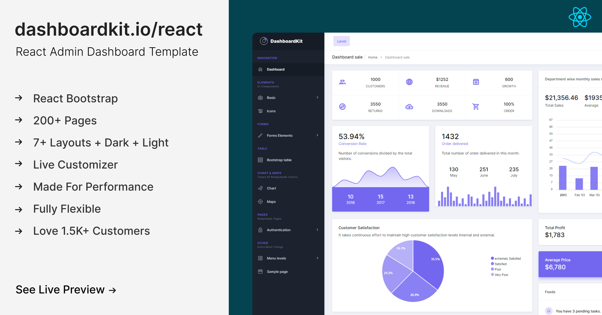

# Documentation

## About DashboardKit

[DashboardKit](https://dashboardkit.io) is the most `developer-friendly` & highly customizable React Admin Template based on React. It has everything you need for your backend projects.

DashboardKit has plenty of ready-to-use React Bootstrap components that will help you build your site faster and save your development time.

We’ve followed industry standards to make DashboardKit easy, fast, and highly scalable. It is made with high-end technology stacks like React Hooks, Components, Create React App, Redux, and Redux-saga.

## Technology Stack

* React Bootstrap
* React Hooks API
* Redux & React Context API for State Management
* Redux Saga Middletier
* React Router
* Axios
* Code Splitting
* CSS-in-JS
* Vite

## Credits

* [React Hooks (18.3.1)](https://reactjs.org/docs/hooks-intro.html)
* [Redux](https://redux.js.org/)
* [React Router](https://github.com/ReactTraining/react-router)
* [Redux-Saga](https://redux-saga.js.org/)
* [Google Fonts](https://fonts.google.com/)
* [Vite](https://vite.dev/)

## Any Suggestion? OR Feedback

Feedback from our beloved community is always welcome. Feel free to reach out anytime at our [Support Panel.](https://codedthemes.support-hub.io) We would love to hear from you anytime.
